# Question 2 — Densité, clustering et structure small-world

Tout est calculé sur le LCC, puisque les tailles données dans l'énoncé (762, 6402, 5157) sont celles du LCC.

## 2a — Statistiques globales et distribution des degrés

| école | n | m | densité | C global | ⟨C local⟩ |
|---|---|---|---|---|---|
| Caltech36 | 762 | 16 651 | 0.0574 | 0.291 | 0.409 |
| MIT8 | 6 402 | 251 230 | 0.0123 | 0.180 | 0.272 |
| JohnsHopkins55 | 5 157 | 186 572 | 0.0140 | 0.193 | 0.269 |

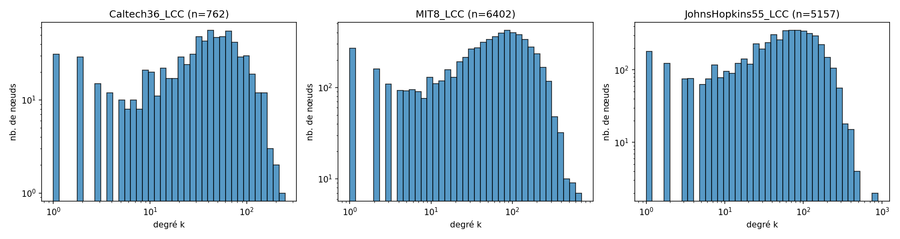

Les trois réseaux sont sparses : la densité monte à 5.7 % pour Caltech (le plus petit) mais tombe en dessous de 1.5 % pour MIT et Johns Hopkins. C'est cohérent avec ce qu'on attend d'un graphe social — chaque utilisateur n'a de lien qu'avec une petite fraction des autres membres de son université.

Les coefficients de clustering sont en revanche très élevés par rapport à ceux d'un graphe aléatoire de même densité : le clustering local moyen vaut environ 7× la densité pour Caltech, 22× pour MIT, 19× pour Johns Hopkins. Combiné à la faible densité, ça donne la signature classique d'un réseau small-world : les amis de mes amis sont très souvent eux-mêmes liés, ce qui correspond à de fortes communautés locales (promos, dorms, départements).

Le clustering global (transitivité) est plus bas que le clustering local moyen sur les trois graphes. C'est typique des graphes hétérogènes en degré : les hubs ont beaucoup de triplets ouverts qui ne se ferment pas et tirent la transitivité globale vers le bas, tandis que la moyenne des C(v) est dominée par les nombreux nœuds de petit degré qui appartiennent à des cliques.

## 2b — Clustering local en fonction du degré

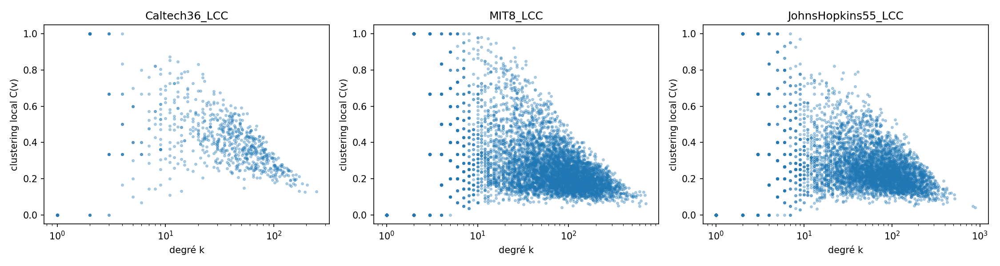

Sur les trois graphes, C(v) décroît avec k, à peu près en 1/k sur deux ordres de grandeur. Ça suggère une organisation hiérarchique : les nœuds peu connectés appartiennent à des cliques denses, tandis que les hubs connectent plusieurs cliques différentes et ont donc proportionnellement moins de triangles fermés.

Caltech se distingue très nettement : densité et clustering local moyen 4 à 5× plus élevés que les deux autres. C'est cohérent avec le fait que Caltech est le plus petit campus du dataset, avec une vie sociale très structurée par les *house systems* qui jouent le rôle des dorms. MIT et Johns Hopkins se ressemblent davantage entre eux : populations comparables, structures comparables.

# Question 3 — Assortativité par attribut sur les 100 graphes

Calcul effectué sur le LCC de chaque graphe, pour les 100 graphes du dataset. Pour les attributs catégoriels (status, major, dorm, gender) j'utilise l'assortativité de Newman ; pour le degré c'est le coefficient de Pearson sur les degrés des extrémités. Avant le calcul je retire les nœuds dont l'attribut vaut 0 (= manquant dans Facebook100), sinon « manquant » est traité comme une catégorie à part entière, ce qui biaise le résultat.

| attribut | moyenne | médiane | min | max | % > 0 |
|---|---|---|---|---|---|
| status | 0.323 | 0.317 | 0.110 | 0.543 | 100 % |
| dorm | 0.227 | 0.221 | 0.079 | 0.485 | 100 % |
| degree | 0.063 | 0.065 | -0.066 | 0.197 | 89 % |
| major | 0.056 | 0.050 | 0.030 | 0.151 | 100 % |
| gender | 0.053 | 0.055 | -0.092 | 0.246 | 89 % |

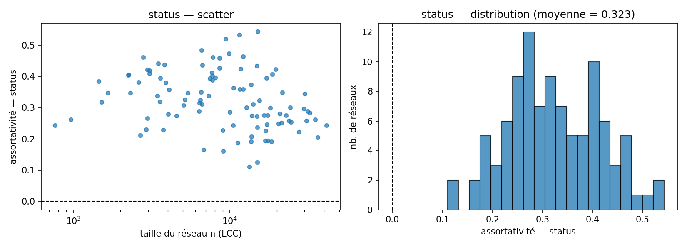

Le statut (étudiant / faculty / staff / alumni) est de loin l'attribut le plus assortatif : moyenne de 0.32, jamais en dessous de 0.11. Les étudiants se lient massivement entre eux, les alumni entre eux, le personnel entre lui. C'est attendu : ces catégories correspondent à des étapes différentes du parcours et fréquentent les mêmes lieux et les mêmes cohortes, et leurs interactions inter-groupes sont rares en 2005.

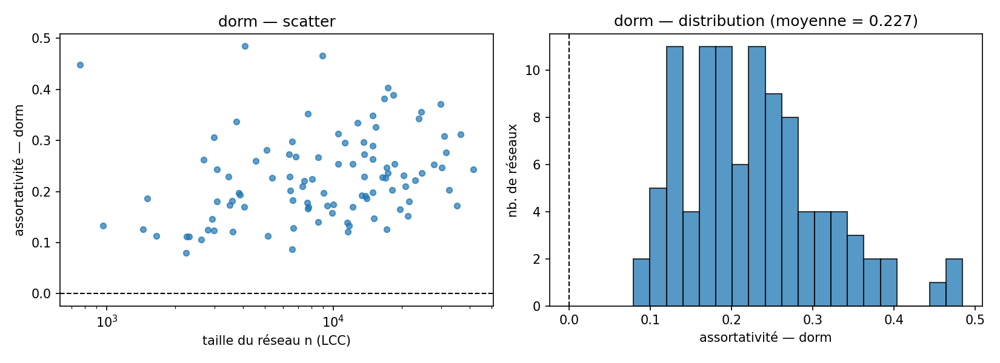

Le dorm arrive en deuxième position avec une moyenne de 0.23 et des valeurs jusqu'à 0.48. Toujours positif. La cohabitation est un générateur d'amitiés très efficace en première année — on partage l'espace, les repas, les soirées — et ces liens se cristallisent rapidement sur Facebook. L'amplitude des valeurs (entre 0.08 et 0.48) reflète probablement la diversité des organisations résidentielles : les universités où les dorms sont thématiques ou par promotion ont une assortativité plus élevée que celles où le placement est plus aléatoire.

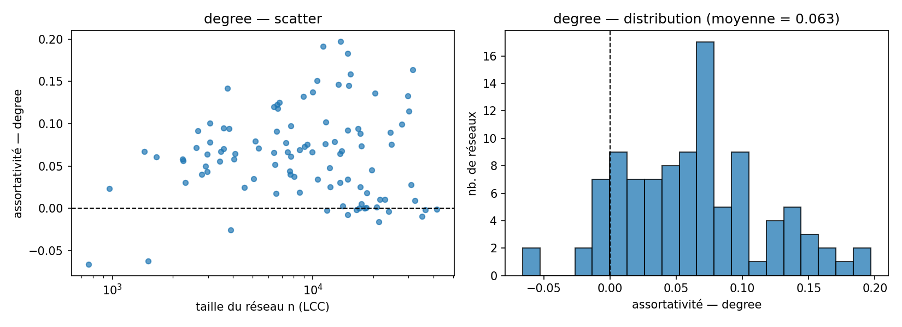

L'assortativité de degré est légèrement positive en moyenne (0.06) mais avec une variance importante : 89 % des graphes sont positifs, mais 11 % sont dissortatifs. C'est typique des réseaux sociaux (par opposition aux réseaux technologiques qui sont franchement dissortatifs), avec un effet modéré : les hubs gardent un certain nombre d'amis peu connectés.

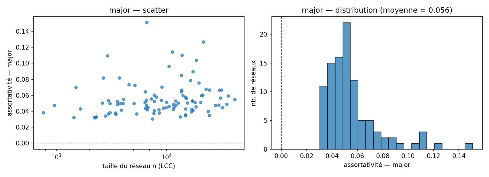

Le major est positif partout mais avec une amplitude faible (0.03 à 0.15, moyenne 0.06). Les étudiants d'un même département se croisent en cours et en TP, ce qui crée une homophilie réelle, mais beaucoup d'amitiés se forment via la résidence et la promotion, où les majors se mélangent.

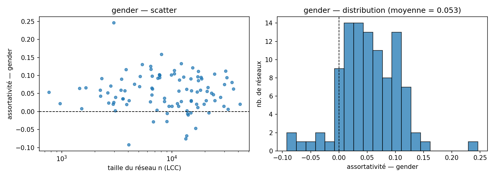

Le gender est l'attribut le moins assortatif : moyenne de 0.053, distribution centrée près de 0, avec quelques universités franchement positives et quelques-unes négatives (jusqu'à -0.09). Comme le sujet le suggère, la faible amplitude indique que le genre n'est pas un facteur structurant majeur des amitiés Facebook : on parle d'une faible homophilie globale, pas d'une ségrégation. Les valeurs négatives correspondent vraisemblablement à des universités où la dynamique de couples hétéro influence les liens d'amitié visibles.

L'ordre observé `status > dorm > degree ≈ major ≈ gender` est cohérent avec ce que rapportent Traud *et al.* Les deux processus qui dominent l'amitié sur Facebook 2005 sont l'appartenance au même groupe institutionnel (statut) et la cohabitation (dorm), très loin devant les homophilies plus douces comme le major ou le genre.

# Question 4 — Prédiction de liens

## 4b — Implémentation des trois métriques topologiques

J'ai écrit la classe abstraite `LinkPrediction` (en suivant le listing 1 du sujet) dans [src/q4_link_prediction/base.py](src/q4_link_prediction/base.py), puis les trois métriques dans [src/q4_link_prediction/metrics.py](src/q4_link_prediction/metrics.py).

Pour chaque prédicteur, `fit` précalcule les voisinages comme des `set` Python : ça permet de faire les intersections en O(min(|Γ(u)|, |Γ(v)|)) au lieu de retraverser le graphe networkx à chaque appel. Pour Adamic-Adar je précalcule aussi `1/log(deg(w))` pour chaque nœud, comme ça `predict` se résume à une somme sur les voisins communs.

Définitions :

- Common Neighbors : `score(u,v) = |Γ(u) ∩ Γ(v)|`
- Jaccard : `|Γ(u) ∩ Γ(v)| / |Γ(u) ∪ Γ(v)|`
- Adamic / Adar : `Σ_{w ∈ Γ(u) ∩ Γ(v)} 1 / log|Γ(w)|`

## 4c — Protocole d'évaluation et résultats agrégés

Code dans [src/q4_link_prediction/evaluation.py](src/q4_link_prediction/evaluation.py) et [run.py](src/q4_link_prediction/run.py). Le protocole est celui de l'énoncé :

1. retirer aléatoirement une fraction `f` des arêtes (`f ∈ {0.05, 0.10, 0.15, 0.20}`),
2. entraîner le prédicteur sur le graphe résiduel,
3. scorer chaque paire de non-arêtes,
4. trier par score décroissant et garder le top-k,
5. comparer au set des arêtes retirées pour calculer top@k, precision@k et recall@k pour `k ∈ {50, 100, 150, 200, 250, 300, 350, 400}`.

L'énoncé demande d'itérer sur toutes les paires `|V|×|V|`. Pour Common Neighbors, Jaccard et Adamic-Adar, les paires sans aucun voisin commun ont un score nul et ne peuvent jamais entrer dans le top-k. J'énumère donc uniquement les paires (u, v) partageant au moins un voisin (= les chemins de longueur 2), ce qui rend traitables les graphes plus gros sans changer le résultat du top@k.

`precision@k` et `top@k` sont identiques par construction (le top-k contient k éléments donc TP+FP = k, d'où TP/k = TP/(TP+FP)). Je rapporte les deux pour rester fidèle à l'énoncé.

J'ai lancé le protocole sur 12 écoles de tailles modérées (Caltech, Reed, Simmons, Haverford, Swarthmore, Amherst, Bowdoin, Wesleyan, Oberlin, Smith, Hamilton, Mich67) ; je présente les résultats agrégés ci-dessous, puis quelques exemples par école.

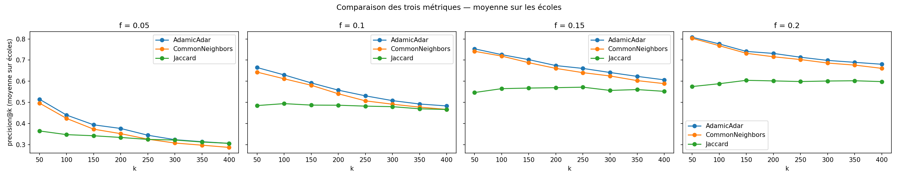

Les trois métriques se classent de façon stable : Adamic-Adar et Common Neighbors font à peu près jeu égal et largement au-dessus de Jaccard. Le tableau suivant donne la moyenne de precision@k=100 sur les 12 écoles :

| f retiré | CommonNeighbors | Jaccard | AdamicAdar |
|---|---|---|---|
| 0.05 | 0.42 | 0.35 | 0.44 |
| 0.10 | 0.61 | 0.49 | 0.63 |
| 0.15 | 0.72 | 0.57 | 0.73 |
| 0.20 | 0.77 | 0.59 | 0.78 |

On voit aussi que la precision@k augmente avec la fraction retirée. C'est attendu : à f=0.05 il y a peu d'arêtes à retrouver, donc la chance qu'une paire bien notée par la métrique soit effectivement dans `E_removed` est plus faible (beaucoup des paires bien notées correspondent à des arêtes du graphe d'origine qui n'ont pas été retirées). À f=0.20 il y a quatre fois plus d'arêtes à retrouver et la même paire candidate a quatre fois plus de chances de tomber juste.

Côté courbes par école, deux exemples typiques :

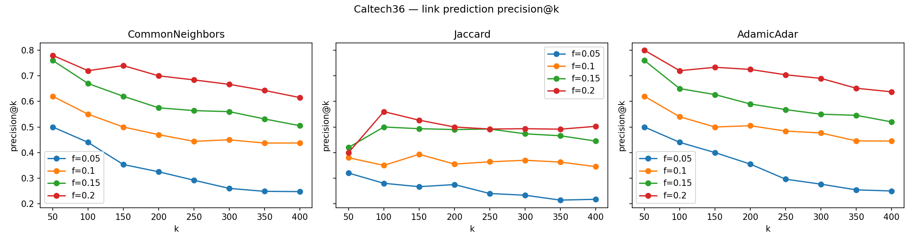

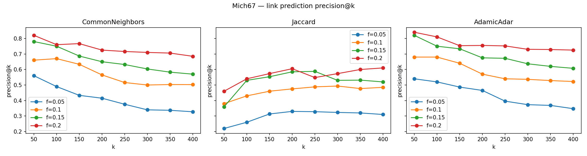

La precision décroît avec k : les premières paires du top-k sont les plus sûres et la qualité s'érode quand on descend dans le classement, ce qui est la sémantique normale d'un classement par score.

Reed98 est l'école sur laquelle les trois métriques sont les moins performantes (precision@100 autour de 0.20 à f=0.05). Reed est aussi parmi les plus petits réseaux du dataset : moins de voisins communs disponibles, donc moins de signal pour ces métriques topologiques pures.

Côté recall, les valeurs restent faibles parce que k est petit devant le nombre d'arêtes retirées. Sur les écoles les plus grandes (par exemple Mich67 avec plusieurs milliers d'arêtes retirées à f=0.05), 100 prédictions correctes ne représentent qu'environ 1 % des arêtes à retrouver. Le tableau ci-dessous donne le recall@400 moyen :

| f retiré | CommonNeighbors | Jaccard | AdamicAdar |
|---|---|---|---|
| 0.05 | 0.040 | 0.044 | 0.042 |
| 0.10 | 0.035 | 0.034 | 0.036 |
| 0.15 | 0.030 | 0.028 | 0.031 |
| 0.20 | 0.025 | 0.023 | 0.026 |

Le recall décroît avec f parce que `|E_removed|` augmente proportionnellement, alors que k reste fixé à 400. Pour interpréter le compromis precision / recall, c'est plus parlant de regarder precision et recall ensemble : à f=0.20 par exemple, Adamic-Adar atteint 78 % de precision@100 mais ne récupère que 2.6 % des arêtes retirées avec ses 400 meilleures prédictions.

## 4d — Comparaison école par école et choix de la métrique

En agrégeant la precision sur toutes les valeurs de k et de f, j'obtiens un classement par école :

| école | CommonNeighbors | Jaccard | AdamicAdar | gagnant |
|---|---|---|---|---|
| Amherst41 | 0.61 | 0.65 | 0.63 | Jaccard |
| Bowdoin47 | 0.62 | 0.53 | 0.63 | AdamicAdar |
| Caltech36 | 0.53 | 0.40 | 0.54 | AdamicAdar |
| Hamilton46 | 0.54 | 0.60 | 0.56 | Jaccard |
| Haverford76 | 0.55 | 0.51 | 0.58 | AdamicAdar |
| Mich67 | 0.59 | 0.46 | 0.62 | AdamicAdar |
| Oberlin44 | 0.55 | 0.42 | 0.57 | AdamicAdar |
| Reed98 | 0.34 | 0.39 | 0.36 | Jaccard |
| Simmons81 | 0.53 | 0.24 | 0.54 | AdamicAdar |
| Smith60 | 0.76 | 0.45 | 0.78 | AdamicAdar |
| Swarthmore42 | 0.50 | 0.65 | 0.51 | Jaccard |
| Wesleyan43 | 0.70 | 0.60 | 0.71 | AdamicAdar |

Trois enseignements concrets :

1. Adamic-Adar bat systématiquement Common Neighbors, mais l'écart est toujours faible (entre 0.4 et 2.9 points de precision moyenne). Les deux métriques sont essentiellement équivalentes en pratique, AA prenant l'avantage en pondérant les voisins communs par l'inverse du log de leur degré, ce qui rabaisse le poids des hubs amicaux qui apportent peu d'information.
2. Jaccard est plus instable : il est largement battu sur la majorité des écoles (Simmons -28 pts, Smith -31 pts, Reed -3 pts contre AA), mais il gagne sur 4 écoles (Amherst, Hamilton, Reed, Swarthmore). La normalisation par l'union pénalise les hubs : sur les graphes où les amitiés sont concentrées entre nœuds de degré moyen, ça aide ; sur les graphes avec quelques hubs très connectés, ça défavorise des paires pourtant pertinentes.
3. La performance absolue dépend beaucoup de l'école. Reed est le mauvais élève (precision moyenne ~0.35) probablement parce que c'est un des plus petits graphes et que la structure y est plus aléatoire ; Smith et Wesleyan sont les plus prévisibles (0.7+).

En résumé, **pour cette tâche j'utiliserais Adamic-Adar** : c'est le plus stable, jamais largement battu, et il intègre une pondération qui a du sens sociologiquement (un ami partagé avec quelqu'un de très populaire est moins informatif qu'un ami partagé avec un nœud moins connecté). Common Neighbors fait presque aussi bien et coûte moins cher (pas de log). Jaccard est à éviter par défaut, sauf à savoir que la structure du graphe le favorise.

## 4e — Bonus : prédiction par GCN

Code dans [src/q4_link_prediction/gnn.py](src/q4_link_prediction/gnn.py). GCN à 2 couches (hidden=64, embed=32, dropout 0.5), features de nœud = attributs Facebook catégoriels (status, gender, major, dorm, year) en one-hot + degré normalisé. Le score d'une paire est le produit scalaire `z_u · z_v`, l'entraînement se fait en BCE sur les arêtes du graphe résiduel comme positives contre des paires uniformément échantillonnées comme négatives au ratio 1:1, Adam (lr=1e-2), 100 epochs. `GCNLinkPredictor` hérite de `LinkPrediction` comme les autres prédicteurs, ce qui permet de le brancher directement dans le protocole de 4c. Tourné sur 5 écoles (Caltech36, Reed98, Haverford76, Simmons81, Swarthmore42) parce que chaque entraînement coûte ~20 s, et que la comparaison se fait sur les mêmes graphes que 4c.

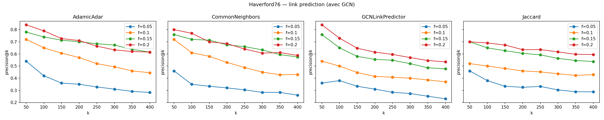

Precision@k=100 moyennée sur les 4 fractions :

| école | CN | Jaccard | AA | GCN |
|---|---|---|---|---|
| Caltech36 | 0.59 | 0.42 | 0.59 | 0.27 |
| Reed98 | 0.39 | 0.36 | 0.39 | 0.20 |
| Haverford76 | 0.61 | 0.56 | 0.65 | 0.57 |
| Simmons81 | 0.62 | 0.25 | 0.62 | 0.59 |
| Swarthmore42 | 0.57 | 0.71 | 0.57 | 0.27 |
| moyenne | 0.56 | 0.46 | 0.56 | 0.38 |

Le GCN est en moyenne nettement en dessous des heuristiques (-18 points contre AA), avec un comportement non uniforme : sur Haverford et Simmons il fait à peu près jeu égal avec CN/AA, mais sur Caltech, Reed et Swarthmore il perd ~30 points. C'est cohérent avec la nature de la tâche : les heuristiques regardent directement les voisins partagés, qui est le signal le plus fort pour la présence d'une arête, alors que le GCN doit le reconstruire à travers la propagation. Les attributs de nœud (status, dorm, year, major, gender) apportent peu de signal supplémentaire : à l'intérieur d'un dorm, beaucoup de paires existent et beaucoup d'autres non, donc l'information attribut ne discrimine pas bien.

Sur le compromis temps / performance, le GCN coûte 20 à 100× plus cher qu'Adamic-Adar pour un résultat globalement moins bon. Sur les Facebook100, les heuristiques topologiques restent une baseline difficile à battre avec un modèle simple.

# Question 5 — Propagation de labels par GCN

## 5b — Implémentation du GCN de Kipf & Welling

Code dans [src/q5_label_propagation/gcn.py](src/q5_label_propagation/gcn.py). C'est le GCN à 2 couches du papier, recodé en PyTorch :

```text
H^(1) = ReLU( D^(-1/2) Â D^(-1/2) X W^(0) )
H^(1) = Dropout(H^(1), p=0.5)
H^(2) = D^(-1/2) Â D^(-1/2) H^(1) W^(1)
```

avec `Â = A + I`, sortie en logits, cross-entropy calculée uniquement sur les nœuds dont le label n'est pas masqué (le masquage du cadre semi-supervisé). Adam à lr=0.01, weight_decay=5e-4, 200 epochs avec early stopping (patience=30) sur un set de validation tiré dans les nœuds étiquetés. Deux couches comme Kipf-Welling : au-delà, le GCN sur un seul graphe oversmoothe (tous les embeddings convergent vers une moyenne globale). Dimension cachée 64 et dropout 0.5 sont les valeurs par défaut du papier. Pas de batch norm : un seul graphe par batch, ça n'aurait rien apporté.

## 5c — Construction des features de nœud

Features de nœud : les attributs Facebook (status, gender, major, dorm, year) en one-hot, plus le degré normalisé. Pour prédire `target`, je retire `target` des features — sinon le GCN voit la réponse pour les nœuds non masqués et la propage trivialement aux voisins, ce qui contourne le protocole d'évaluation.

## 5d — Accuracy et MAE en fonction de la fraction masquée

Run sur le LCC de Duke14 (n=9 885, m=506 437). Pour chaque attribut, je masque 10/20/30/40 % des labels parmi les nœuds qui en ont un, en écartant au préalable les nœuds avec attribut = 0 (sinon « manquant » devient une classe à part entière). Accuracy et MAE calculées sur les nœuds masqués.

| attribut (n classes) | 10 % | 20 % | 30 % | 40 % |
|---|---|---|---|---|
| Major (66) | 0.140 | 0.112 | 0.125 | 0.129 |
| Dorm (135) | 0.189 | 0.179 | 0.194 | 0.161 |
| Year (23) | 0.850 | 0.852 | 0.844 | 0.839 |
| Gender (2) | 0.743 | 0.740 | 0.733 | 0.725 |

| attribut | MAE 10 % | MAE 20 % | MAE 30 % | MAE 40 % |
|---|---|---|---|---|
| Major | 18.5 | 17.6 | 17.2 | 18.2 |
| Dorm | 18.9 | 20.0 | 20.9 | 22.7 |
| Year | 0.23 | 0.23 | 0.24 | 0.24 |
| Gender | 0.26 | 0.26 | 0.27 | 0.27 |

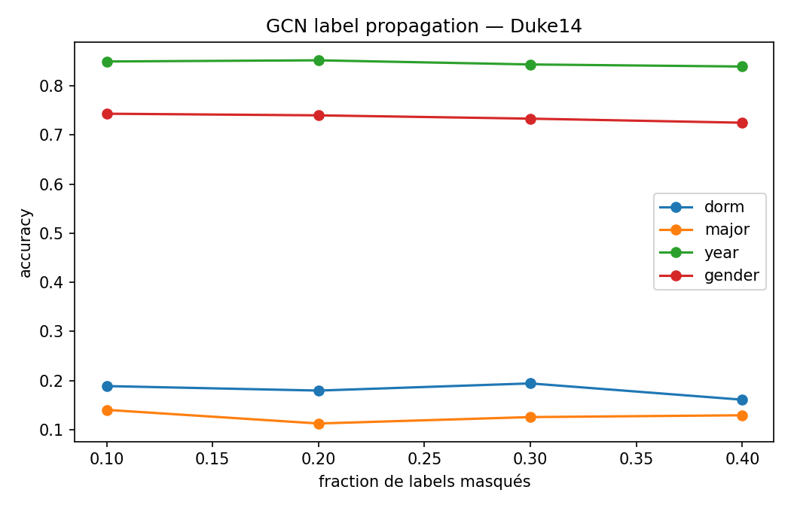

La MAE n'a pas vraiment de sens pour `dorm` ou `major` parce que l'index de classe est arbitraire ; pour `gender` (2 classes) c'est `1 - accuracy` et pour `year` c'est interprétable comme un écart en années. Elle est rapportée parce que le sujet la demande.

Comparaison avec le tableau de référence :

| attribut | sujet 10 % | obtenu 10 % | sujet 40 % | obtenu 40 % |
|---|---|---|---|---|
| Major | 0.282 | 0.140 | 0.241 | 0.129 |
| Dorm | 0.529 | 0.189 | 0.463 | 0.161 |
| Year | 0.913 | 0.850 | 0.891 | 0.839 |
| Gender | 0.675 | 0.743 | 0.679 | 0.725 |

Year et Gender sont proches des valeurs du sujet (un peu en dessous pour year, un peu au-dessus pour gender). Dorm et Major sont nettement en dessous des valeurs attendues.

## 5e — Lien entre performance et assortativité

L'écart entre attributs s'explique par leur assortativité (Q3) combinée au nombre de classes. Year à 0.85 : très assortatif via les promotions, 23 classes ; les amitiés se font massivement entre étudiants de la même cohorte, donc la propagation transmet bien le label. Gender à 0.73 : faiblement assortatif (moyenne 0.05) mais seulement 2 classes ; la baseline « classe majoritaire » sur Duke est déjà autour de 0.6, le GCN gagne ~10 points, ce qui est cohérent avec une homophilie faible mais non nulle. Dorm à 0.19 : assortatif (moyenne 0.23) mais 135 classes, dont beaucoup avec très peu de nœuds — l'accuracy globale est tirée vers le bas par le grand nombre de petites classes, même si 0.19 reste très au-dessus du hasard (1/135 ≈ 0.7 %). Major à 0.13 : faiblement assortatif (0.06) et 66 classes ; les deux effets se cumulent et la structure du graphe porte très peu d'info sur le département.

L'ordre observé (year ≫ gender > dorm > major) correspond à ce que prédisaient les valeurs d'assortativité de Q3 : un classifieur basé sur le graphe est plafonné par la quantité d'information que la structure porte sur l'attribut.

# Question 6 — Détection de communautés et attributs

## 6a — Hypothèse

À quel attribut individuel (dorm, year, major) correspondent le mieux les communautés détectées par un algorithme de modularité sur les graphes Facebook100 ? Hypothèse, à partir de Q3 : Q3 a montré que dorm et year sont les attributs les plus assortatifs et que major l'est très peu. Les communautés détectées par Louvain devraient donc s'aligner surtout avec dorm ou year selon l'école, et très peu avec major. L'idée derrière : la structure communautaire d'un graphe social est portée par les attributs les plus assortatifs, et un attribut faiblement assortatif ne ressort pas comme cluster même quand l'algo le « cherche ».

## 6b — Louvain vs Label Propagation, alignement avec les attributs

Code dans [src/q6_communities/run.py](src/q6_communities/run.py). Sur 5 écoles de tailles variées (Caltech36, Reed98, Haverford76, Smith60, JohnsHopkins55) je fais tourner deux algorithmes disponibles dans NetworkX : Louvain (`louvain_communities`) et label propagation algorithmique (`label_propagation_communities`). Pour chaque partition je calcule la modularité, puis je la compare aux attributs dorm / year / major via NMI (Normalized Mutual Information) et ARI (Adjusted Rand Index). Avant le calcul de NMI / ARI je filtre les nœuds dont l'attribut vaut 0, sinon « manquant » est traité comme une catégorie à part entière et tire les scores vers le bas (même précaution qu'en Q3).

Moyenne des scores sur les 5 écoles :

| algo | NMI dorm | NMI year | NMI major | ARI dorm | ARI year | ARI major |
|---|---|---|---|---|---|---|
| Louvain | 0.357 | 0.349 | 0.079 | 0.223 | 0.313 | 0.012 |
| LabelProp | 0.047 | 0.203 | 0.027 | 0.006 | 0.087 | 0.002 |

Détail par école avec Louvain :

| école | NMI dorm | NMI year | NMI major | modularité | nb communautés |
|---|---|---|---|---|---|
| Caltech36 | 0.703 | 0.086 | 0.079 | 0.40 | 8 |
| Reed98 | 0.123 | 0.458 | 0.061 | 0.32 | 5 |
| Haverford76 | 0.196 | 0.616 | 0.061 | 0.34 | 5 |
| Smith60 | 0.497 | 0.181 | 0.077 | 0.39 | 18 |
| JohnsHopkins55 | 0.269 | 0.403 | 0.117 | 0.45 | 9 |

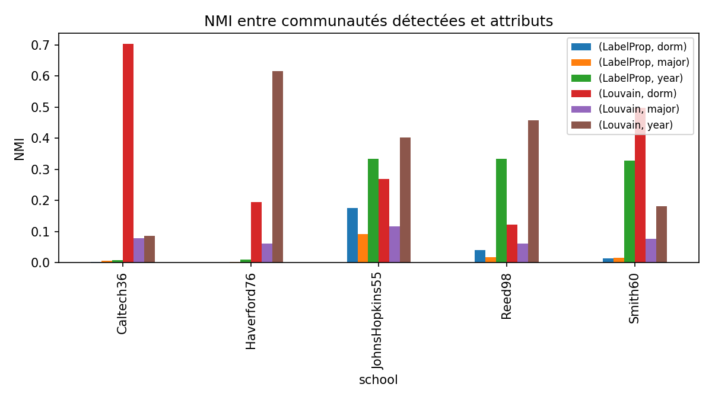
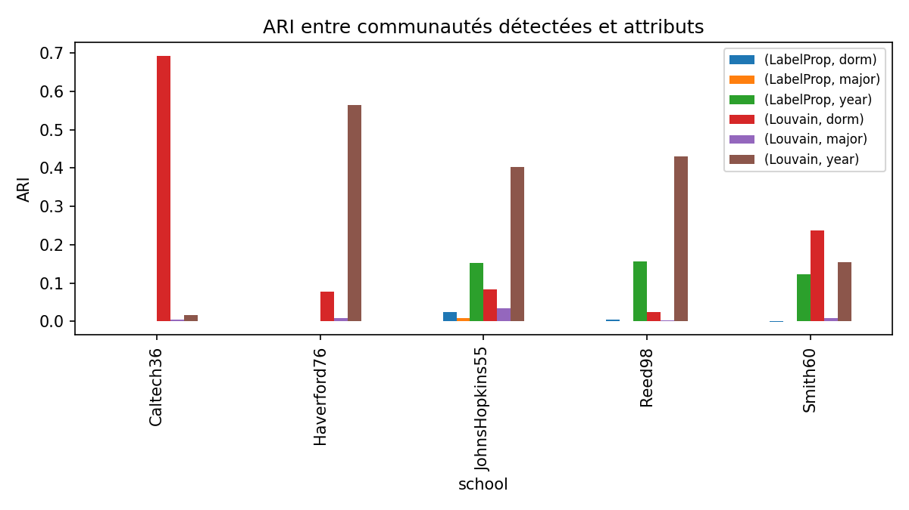

## 6c — Discussion

Pour Louvain, NMI vs dorm et NMI vs year sont du même ordre de grandeur (~0.35) tandis que NMI vs major est un ordre de magnitude plus bas (~0.08). C'est cohérent avec l'hypothèse de 6a : les communautés captent la cohabitation et la promotion, pas le département.

Caltech36 est le cas extrême du dorm avec NMI=0.70, ARI=0.69 — Caltech a un système de *houses* très structurant qui joue le rôle des dorms et qui ressort presque parfaitement comme partition communautaire. Reed et Haverford sont au contraire dominées par la promotion (NMI vs year > 0.45). Smith et Johns Hopkins sont des cas mixtes où dorm et year contribuent ensemble. Le major reste invariablement bas (NMI < 0.13), cohérent avec l'assortativité faible vue en Q3.

Label Propagation est largement battu par Louvain : sur la plupart des écoles il converge en 2-3 macro-communautés avec une modularité quasi nulle (3e-5 à 1e-4), ce qui correspond à un regroupement de quasiment tout le graphe en un seul bloc géant. Louvain est nettement plus fiable pour cette comparaison.

L'expérience confirme l'hypothèse de 6a : à l'intérieur d'une école, l'attribut qui domine la structure communautaire est selon les cas le dorm ou la year. Le major ne ressort jamais comme cluster, ce qui colle avec les valeurs d'assortativité de Q3.
